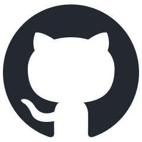

 <a href="https://github.com/kth-step/plfm-course">View the course on GitHub</a>

## About the course

This [course at KTH](https://www.kth.se/student/kurser/kurs/FDD3024/?l=en) introduces theory, methods, and tools that are prerequisites for research in the areas of programming languages and formal methods. The course awards 10 ECTS credits and the examiner is [Mads Dam](https://www.kth.se/profile/mfd/).

## Course intended learning outcomes

At the end of the course the student should be able to:

- Apply several theories and methods covered in the course on sample problems of limited scope and size
- Evaluate the suitability of a given theory/method within a given problem domain
- Define and execute a first own research project within the students research area
- Account for choice of approach
- Relate own work to the state of the art in the area

## Course organization

The course consists of five modules given by members of faculty and postdocs at the [KTH Department of Theoretical Computer Science](https://www.kth.se/tcs/) over a full term = two periods. Each module consists of 3-6 lectures.

## Course examination

At the end of each period the course spans, a take-home exam is given over two days consisting of one problem set per module associated with that period. After handing in written solutions, students must book a slot to present and discuss their solutions with a teacher, who will then grade each problem set pass/fail. A student must get a pass on all problem sets to pass the course.

## Course modules

**Module 1 (Period 4, spring 2026)**

- Topic: Lambda calculus, operational semantics, and types
- Teachers: Karl Palmskog and Mohammad Ahmadpanah
- Course literature: [Practical Foundations for Programming Languages, 2nd edition](https://www.cs.cmu.edu/~rwh/pfpl/) by Robert Harper, <strong>PFPL</strong> for short, see [abbreviated online edition](http://www.cs.cmu.edu/~rwh/pfpl/abbrev.pdf)

**Module 2 (Period 4, spring 2026)**

- Topic: Formal models of concurrency, process algebras, execution traces, bisimulation, weak memory models, modal logics
- Teachers: Mads Dam and Roberto Guanciale

**Module 3 (Period 4, spring 2026)**

- Topic: Hoare logic, imperative program verification
- Teachers: Karl Palmskog and Roberto Guanciale

**Module 4 (Period 1, fall 2026)**

- Topic: Symbolic execution and abstract interpretation
- Teachers: Roberto Guanciale and Musard Balliu

**Module 5 (Period 1, fall 2026)**

- Topic: Security and information flow control
- Teachers: Musard Balliu and Mohammad Ahmadpanah 

## Lecture Schedule for Period 4, 2026

<table>
<thead>
<tr class="header">
<th align="left">Lecture</th>
<th align="left">Module</th>
<th align="left">Date</th>
<th align="left">Time</th>
<th align="left">Location</th>
<th align="left">Topic</th>
<th align="left">Slides</th>
</tr>
</thead>
<tbody>
<tr class="odd">
<td align="left">1</td>
<td align="left">1</td>
<td align="left">Apr&nbsp;13</td>
<td align="left">13:00</td>
<td align="left"><a href="https://www.kth.se/places/room/id/7beef522-ce4c-4926-98bd-73eed4956ed9">room 1537</a></td>
<td align="left">Inductive rules, operational semantics, untyped lambda calculus</td>
<td align="left"><a href="./module-1/lectures/lecture-1.pdf">Lecture 1</a></td>
</tr>
<tr class="even">
<td align="left">2</td>
<td align="left">1</td>
<td align="left">Apr 15</td>
<td align="left">15:00</td>
<td align="left"><a href="https://www.kth.se/places/room/id/7beef522-ce4c-4926-98bd-73eed4956ed9">room 1537</a></td>
<td align="left">Simply typed lambda calculus, type systems, ML</td>
<td align="left"><a href="./module-1/lectures/lecture-2.pdf">Lecture 2</a></td>
</tr>
<tr class="odd">
<td align="left">3</td>
<td align="left">1</td>
<td align="left">Apr 20</td>
<td align="left">13:00</td>
<td align="left"><a href="https://www.kth.se/places/room/id/7beef522-ce4c-4926-98bd-73eed4956ed9">room 1537</a></td>
<td align="left">Data types, abstract types, polymorphism, module systems</td>
<td align="left">TBA</td>
</tr>
<tr class="even">
<td align="left">4</td>
<td align="left">1</td>
<td align="left">Apr 23</td>
<td align="left">13:00</td>
<td align="left"><a href="https://www.kth.se/places/room/id/7beef522-ce4c-4926-98bd-73eed4956ed9">room 1537</a></td>
<td align="left">Simple types, dependent types, theorem proving</td>
<td align="left">TBA</td>
</tr>
<tr class="odd">
<td align="left">5</td>
<td align="left">2</td>
<td align="left">Week 18</td>
<td align="left">TBA</td>
<td align="left">TBA</td>
<td align="left">Concurrency</td>
<td align="left">TBA</td>
</tr>
<tr class="even">
<td align="left">6</td>
<td align="left">2</td>
<td align="left">Week&nbsp;18</td>
<td align="left">TBA</td>
<td align="left">TBA</td>
<td align="left">Concurrency</td>
<td align="left">TBA</td>
</tr>
<tr class="odd">
<td align="left">7</td>
<td align="left">2</td>
<td align="left">Week 19</td>
<td align="left">TBA</td>
<td align="left">TBA</td>
<td align="left">Concurrency</td>
<td align="left">TBA</td>
</tr>
<tr class="even">
<td align="left">8</td>
<td align="left">2</td>
<td align="left">Week 19</td>
<td align="left">TBA</td>
<td align="left">TBA</td>
<td align="left">Concurrency</td>
<td align="left">TBA</td>
</tr>
<tr class="odd">
<td align="left">9</td>
<td align="left">2</td>
<td align="left">Week 20</td>
<td align="left">TBA</td>
<td align="left">TBA</td>
<td align="left">Concurrency</td>
<td align="left">TBA</td>
</tr>
<tr class="even">
<td align="left">10</td>
<td align="left">3</td>
<td align="left">Week 20</td>
<td align="left">TBA</td>
<td align="left">TBA</td>
<td align="left">Hoare logic</td>
<td align="left">TBA</td>
</tr>
<tr class="odd">
<td align="left">11</td>
<td align="left">3</td>
<td align="left">Week 20</td>
<td align="left">TBA</td>
<td align="left">TBA</td>
<td align="left">Hoare logic</td>
<td align="left">TBA</td>
</tr>
<tr class="even">
<td align="left">12</td>
<td align="left">3</td>
<td align="left">Week 20</td>
<td align="left">TBA</td>
<td align="left">TBA</td>
<td align="left">Hoare logic</td>
<td align="left">TBA</td>
</tr>
</tbody>
</table>

## Lecture Resources

<table>
<thead>
<tr class="header">
<th align="left">Lecture</th>
<th align="left">Module</th>
<th align="left">Resources</th>
</tr>
</thead>
<tbody>
<tr class="odd">
<td align="left">1</td>
<td align="left">1</td>
<td align="left">
- [PFPL](http://www.cs.cmu.edu/~rwh/pfpl/abbrev.pdf) chapters 1-2
- [An Introduction to Inductive Definitions](https://lawrencecpaulson.github.io/papers/Aczel-Inductive-Defs.pdf) by Peter Aczel
- [Untyped Lambda Calculus](http://www.cs.cmu.edu/~rwh/pfpl/supplements/ulc.pdf) by Robert Harper
- [A Structural Approach to Operational Semantics](https://homepages.inf.ed.ac.uk/gdp/publications/sos_jlap.pdf) by Gordon Plotkin
</td>
</tr>
<tr class="even">
<td align="left">2</td>
<td align="left">1</td>
<td align="left">
- [PFPL](http://www.cs.cmu.edu/~rwh/pfpl/abbrev.pdf) chapter 4
- [A Sound Semantics for OCaml Light](https://doi.org/10.1007/978-3-540-78739-6_1) by Scott Owens
- [A Verified Type System for CakeML](https://cakeml.org/ifl15.pdf) by Tan et al.
</td>
</tr>
<tr class="odd">
<td align="left">3</td>
<td align="left">1</td>
<td align="left">
- [PFPL](http://www.cs.cmu.edu/~rwh/pfpl/abbrev.pdf) chapters 9-11, 17, 44
- [A theory of type polymorphism in programming](https://doi.org/10.1016/0022-0000(78)90014-4) by Robin Milner
- [Using dependent types to express modular structure](https://doi.org/10.1145/512644.512670) by David B. MacQueen
- [How to make ad-hoc polymorphism less ad hoc](https://doi.org/10.1145/75277.75283) by Wadler and Blott
</td>
</tr>
<tr class="even">
<td align="left">4</td>
<td align="left">1</td>
<td align="left">
- [Church's Type Theory](https://plato.stanford.edu/entries/type-theory-church/) by Stanford Encyclopedia of Philosophy
- [A formulation of the simple theory of types](https://doi.org/10.2307/2266170) by Alonzo Church
- [Dependent types](https://people.cs.nott.ac.uk/psztxa/oplss-22/dependent.pdf) by Thorsten Altenkirch
</td>
</tr>
</tbody>
</table>
